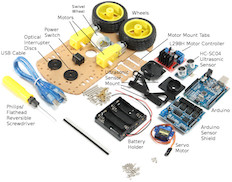
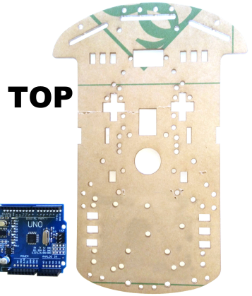
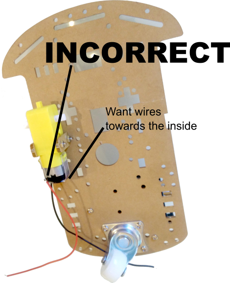
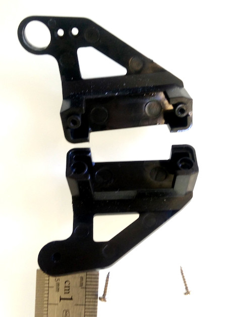

# Assembly Instructions for a Motor Robot Car Kit 2WD, L298N Motor driver, HC-SC04 Ultrasonic module, Arduino

## Original guide and photos by Stephen A. Edwards

This guide will walk you through assembly of the VKmaker Smart Robot 2WD Car.

# There's also a video you can follow along with here

## 1. Mount the Swivel Wheel

| Parts Needed        |
| ------------------- |
| Swivel  Wheel       |
| 8 ×  5 mm M3 screws |
| 4 ×  spacers        |

- Determine the **top** of the baseplate; it is not symmetric. Use the Arduino as a guide.
- Attach the swivel to the **bottom** of the baseplate using the screws and nuts.

    

    

## 2. Mount the Arduino and Sensor Shield

| Parts Needed         |
| -------------------- |
| Arduino              |
| Sensor Shield        |
| 2 × 10 mm M3 spacers |
| 4 × 5 mm M3 screws   |

- Connect the two spacers to the top of the baseplate using two screws
- Mount the Arduino on the spacers using the other two screws

    

- Mount the **Sensor Shield** atop the Arduino. Line up the right edges of the boards. Make sure each pin goes in a connector.

## 3. Mount the Motors on the Bottom of the Baseplate

| Parts Needed         |
| -------------------- |
| 2 ×  motors          |
| 4 ×  acrylic  tabs   |
| 4 ×  30 mm M3 screws |
| 4 ×  M3 nuts         |
| 2 ×  Wheels          |

<!-- - Solder one red and one black wire to each motor. Either terminal can be either color. -->
- Place one tab in a slot **down from the top** of the baseplate, align the motor, and place the other tab on the slot on the side of the baseplate.
- Insert two screws from the outside tab through the motor and inside tab and connect the nuts.

    

    

    

- Repeat the procedure for the other motor
- Mount the wheels on the motors
- (Optional) Attach the optical interrupter discs on the inside axles

    [//]: # (motor driver)

## 4. Mount the Switch, the Battery Holder, and L298N

| Parts Needed                                              |
| --------------------------------------------------------- |
| Rocker Switch                                             |
| L298N board (red)                                         |
| 3 × 5 mm M3 screws                                        |
| 4 × M3 standoffs (longer spacers with screws on one side) |
| 5 × M3 nuts                                               |
| Battery Holder                                            |

- Insert the switch on the top of the baseplate between the two motors

    

- Place the standoff screws through the holes in the L298N board and screw nuts on top to secure it
- Mount the L298N board with connected standoffs to baseplate as shown with 2 of the 5mm M3 screws

|  |  |
| ------------------------------- | --------------------- |
|                                 |                       |

- **Remove the two jumpers** on the L298N board by pulling them up

    

- Locate the battery holder on the underside of the baseplate at the back of the baseplate

    

## 5 Download the Firmware to Center the Servo

| Parts Needed     |
| ---------------- |
| Computer         |
| Servo Motor      |
| robot-car sketch |
| USB cable        |

- Download and install the Arduino IDE from, e.g., http://www.arduino.cc/
- Start the Arduino IDE on your computer.
- Open the “robot-car.ino” sketch (File → Open... → )
- Make sure Tools → Board → Arduino Uno is selected

    

- Plug the servo motor connector into the column of pins labeled “11” on the Sensor Shield. Put the orange wire in the “S” row so the brown wire goes in the “G” row.

|  |  |
| ---------------------- | --------------------- |
|                        |                       |

- Connect the USB cable between your computer and the Arduino
- Make sure a port is selected under Tools → Port
- Click on the “upload” button to compile and send your sketch to the Arduino
- Disconnect the USB cable once the program starts and centers the servo.
- Disconnect the servo connection from the Sensor Shield; we will re connect it later.

## 6 Assemble the Ultrasonic Sensor Mount

| Parts Needed                                       |
| -------------------------------------------------- |
| Ultrasonic sensor base                             |
| Ultrasonic sensor sides                            |
| Servo Motor                                        |
| 1 × 8 mm pan-head screw       |
| 2 × 7 mm self-tapping screws  |
| Drill with 9/64" drill bit                         |

- Drill the circled holes with the 9/64" drill bit to enlarge them

    

- Use the panhead screw to attach the servo to the base

    

    

- Use the two 7 mm screws to connect the two halves to clamp the servo

    

    

- Strap the ultrasonic sensor, pins up, to the mount with two twist ties looped around the two transducers

    

## 7. Attach the Ultrasonic Sensor to the Baseplate

| Parts Needed       |
| ------------------ |
| 8 × 5 mm M3 screws |
| 4 × spacers        |

- Attach the base of the ultrasonic sensor to the top of the baseplate with the screws and nuts.

    

## 8 Connect the power and motor wires

| Parts Needed                     |
| -------------------------------- |
| 1 ×  20 cm length of wire, red   |
| 1 ×  12 cm length of wire, red   |
| 1 ×  12 cm length of wire, black |

- Solder the red wire from the battery holder to one switch terminal
- Solder the 20 cm red wire to the other switch terminal
- Connect the two left motor wires to the left connector on the L298N and the two right motor wires to the right connector. Red and black do not matter here; reverse them if the robot goes backwards.
- Connect two 12 cm lengths of wire to the black (ground) wire from the battery holder and the red (power) wire from the power switch.
- Connect the doubled black (ground) wire to the “GND” terminal on the shield.
- Connect the doubled red (power) wire to the “VCC” terminal on the shield.
- Connect the black 12 cm wire from the shield terminal to the middle screw terminal on the L298N.
- Connect the red 12 cm wire from the shield terminal to the left screw terminal on the L298N.

    

    

## 9. Connect the Ultrasonic Sensor, Servo, and L298N to the Arduino Sensor Shield

| Parts Needed                            |
| --------------------------------------- |
| 4 × 20 cm female-to-female jumper wires |
| 7 × 10 cm female-to-female jumper wires |

| Ultrasonic sensor | Arduino        |
| ----------------- | -------------- |
| Gnd               | 12 G  (Ground) |
| Echo              | 12 S           |
| Trig              | 13 S           |
| Vcc               | 13 V  (+5V)    |

| Servo  | Arduino        |
| ------ | -------------- |
| Brown  | 11 G  (Ground) |
| Red    | 11 V (+5V)     |
| Orange | 11 S           |

| L298N | Arduino   |
| ----- | --------- |
| ENA   | 6 S       |
| IN1   | 7 S       |
| IN2   | 5 S       |
| IN3   | 4 S       |
| IN4   | 2 S       |
| ENB   | 3 S       |
| +5V   | 2 V (+5V) |

**Note Arduino pin order**

# 10. Troubleshooting

- Hold the robot off the ground and plug the USB cable between the Arduino and your computer.
You should see power lights on the Arduino, the Sensor Shield, and the L298N motor controller. If you don’t see all three lights, check the power wiring.
- Shortly after the robot is turned on or reset, it centers the servo
If the servo does not move, verify you have connected the servo to location 11 and the Orange wire is connected to “S.”
If the servo moves but isn’t in the center, remove the ultrasonic sensor mount from the board, disconnect the servo from the base, and reattach the servo in the proper location.
- After centering the servo, the robot turns its left wheel forward then backward, then its right wheel forward then backward.
If a wheel turns backwards, reverse its motor’s connection to the L298N board (swap the red and black motor wires).
If one wheel turns but not the other, check the motor wiring and the wiring between the Arduino and the L298N.
- Disconnect the robot from the computer, turn off the power switch, and plug in 6 AA batteries to the holder on the bottom. Turn on the power switch.
Again, you should see power lights on all three boards. If not, check the wiring around the battery holder and the switch.
11	Software
Below and on the next few pages is the “robot-car.ino” sketch (software) that operates the car. This initial code indicates we will be using a servo motor and defines the pin numbers for the ultrasonic module, the servo motor, and the L298N motor controller.

## 11. Program the robot!

- If you haven't already, grab the  code and program the robot.

## 12. Challenges

- Make your robot dance. Make it "do the robot" by moving wheels and servo in various ways.
- Create a mini-maze for your robot to navigate through to the end.
- Can you make the robot go faster?